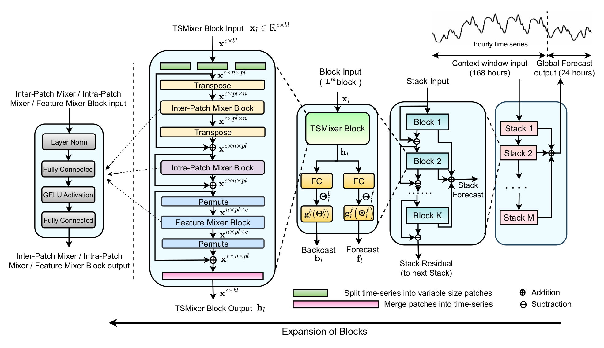

# MixForecast

**Repository for our published foundation model, MixForecast, designed for efficient and accurate short-term load forecasting (STLF) in smart buildings.**

---

## 📰 News

📢 **Our paper on MixForecast has been accepted at [FMSys 2025](https://fmsys-org.github.io/2025/index.html)!**  
Check out the publication below:

> **MixForecast: Mixer-Enhanced Foundation Model for Load Forecasting**  
> *Anuj Kumar, Harish Kumar Saravanan, Shivam Dwivedi, Pandarasamy Arjunan*  
> In *Proceedings of the 2nd International Workshop on Foundation Models for Cyber-Physical Systems & Internet of Things (FMSys 2025)*  
> [DOI: 10.1145/3722565.3727193](https://doi.org/10.1145/3722565.3727193)


---


## 🌐 About MixForecast

**MixForecast** is a novel **Time Series Foundation Model (TSFM)** that combines **N-BEATS** and **TSMixer** blocks to deliver lightweight, generalizable, and high-performing **short-term load forecasting (STLF)** for smart buildings. Designed for **edge-device deployment**, it uses approximately **0.19M parameters**, offering significant efficiency without compromising accuracy.

### ✨ Key Features

- 🧠 Hybrid architecture combining strengths of N-BEATS and TSMixer
- 💡 Lightweight model with only ~0.19M parameters
- 🏠 Trained on 63K smart meter time series from global buildings
- 🌍 Tested on 1,000 commercial and residential buildings worldwide
- 🔄 Supports both zero-shot and fine-tuned load forecasting
- 📈 Outperforms Lag-Llama, Tiny Time Mixers, Moirai, Chronos, and traditional models

---



---
### Dataset Details
Details of Real Building Datasets Used for this Study (Hourly Data)

| Dataset Name       | Location     | No. of Buildings | Years       |
|--------------------|--------------|------------------|-------------|
| **Commercial Buildings** |              |                  |             |
| Enernoc            | USA          | 100              | 2012        |
| IBlend             | India        | 9                | 2013-2017   |
| DGS                | USA          | 322              | 2016-2018   |
| EWELD              | China        | 386              | 2016-2022   |
| **Residential Buildings** |              |                  |             |
| CEEW               | India        | 84               | 2019-2021   |
| Ireland            | Ireland      | 20               | 2020        |
| MFRED              | USA          | 26               | 2019        |
| NEEA               | USA          | 192              | 2018-2020   |
| NEST               | Switzerland  | 1                | 2019-2023   |
| Prayas             | India        | 116              | 2018-2020   |
| SMART*             | USA          | 114              | 2016        |
| SGSC               | Australia    | 13,735           | 2011-2014   |
| GoiEner            | Spain        | 25,559           | 2014-2022   |
| UK SMART Trials    | UK           | 14,319           | 2008-2010   |
| SAVE               | UK           | 4,691            | 2016-2018   |
| iFlex              | Norway       | 4,429            | 2020-2021   |
| **Total**          |              | **64,103**       |             |

---

## Results

Results are shown Below.

### Performance Metrics

The table below compares the forecasting performance of MixForecast with NBEATS and TTMS models across multiple datasets. Metrics include Normalized Root Mean Squared Error (NRMSE):

| Model      |   Dataset   | average NRMSE  |
|------------|----------   |------- |
| MixForecast  | Commercial  | **21.06**  |
| NBEATS    | Commercial  | 25.80  |
| TTMs       | Commercial  | 22.36  |
| MixForecast  | Residential | **80.49**  |
| NBEATS    | Residential | 84.26  |
| TTMs       | Residential | 81.45   | 


The table below compares the forecasting performance of MixForecast with TSFMs in both scenario zero-shot and finetuned across multiple datasets. Metrics include Normalized Root Mean Squared Error (NRMSE):

| Model      |   average NRMSE for Commercial Buildings   | average NRMSE for Residential Buildings |
|------------|----------   |------- |
| MixForecast - zeroshot |  **21.06** |  **80.49** |
| Moirai - zeroshot  |  28.25    | 80.51  |
| Chronos - zeroshot     |    21.08  | 81.99  |
| Lag-llama - zeroshot |    57.42   |   98.51   |
| MixForecast - finetuned |  **20.44**    | 72.45  |
| Moirai - finetuned  |   23.34     | **66.50**  |
| Lag-llama - finetuned  |     23.21    | 80.09   | 

---
### Bareilly and Enernoc Building energy (KWh) time-series Visualization

These Plots are for three consecutive windows of sequence length 168 (7 days) and prediction length 24 (1 day).


### Key Insights

- **MixForecast** outperforms NBEATS and TTMS on NRMSE metrics, demonstrating its robustness and accuracy for STLF tasks.
- The architecture's focus on task-specific enhancements ensures adaptability to diverse building profiles.


### Key Insights

- **MixForecast** outperforms NBEATS and TTMS on NRMSE metrics, demonstrating its robustness and accuracy for STLF tasks.
- The architecture's focus on task-specific enhancements ensures adaptability to diverse building profiles.
---

## 📄 Citation

If you use MixForecast in your research or applications, please cite our paper:

```bibtex
@inproceedings{10.1145/3722565.3727193,
  author = {Kumar, Anuj and Saravanan, Harish Kumar and Dwivedi, Shivam and Arjunan, Pandarasamy},
  title = {MixForecast: Mixer-Enhanced Foundation Model for Load Forecasting},
  year = {2025},
  isbn = {9798400716089},
  publisher = {Association for Computing Machinery},
  address = {New York, NY, USA},
  url = {https://doi.org/10.1145/3722565.3727193},
  doi = {10.1145/3722565.3727193},
  booktitle = {Proceedings of the 2nd International Workshop on Foundation Models for Cyber-Physical Systems & Internet of Things},
  pages = {25--30},
  numpages = {6},
  keywords = {Demand-side Load management, Energy Forecasting, Energy Informatics, Machine Learning, Short-term Load Forecasting (STLF), Smart Grid, Time Series Foundation Models (TSFM)},
  location = {Irvine, CA, USA},
  series = {FMSys}
}
```
---


## Acknowledgements

We would like to express our sincere gratitude to the authors of the following works for their valuable contributions to the field of short-term load forecasting (STLF) and energy prediction, which have influenced and inspired our work on **MixForecast**:

1. **N-BEATS: Neural Basis Expansion Analysis for Time Series** (Oreshkin et al., 2019)  
   - This work introduced N-BEATS, a powerful and scalable model for time series forecasting, which served as a key foundation for the development of our model architecture.  
   - Citation:  
     Oreshkin, B. N., Carpov, D., Chapados, N., & Bengio, Y. (2019). *N-BEATS: Neural Basis Expansion Analysis for Interpretable Time Series Forecasting*. *arXiv preprint arXiv:1905.10437*.

2. **TSMixer: Lightweight MLP-Mixer Model for Multivariate Time Series Forecasting** (Ekambaram et al., 2023)  
   - The TSMixer model's innovative approach to temporal sequence modeling provided significant insights for designing the temporal mixing layers in MixForecast.  
   - Citation:  
     Ekambaram, V., Jati, A., Nguyen, N., Sinthong, P., & Kalagnanam, J. (2023). *TSMixer: Lightweight MLP-Mixer Model for Multivariate Time Series Forecasting*. *Proceedings of the 29th ACM SIGKDD Conference on Knowledge Discovery and Data Mining*, 459–469.


Additionally, we acknowledge the publicly available datasets and the authors of these datasets for making their data accessible, which enabled us to benchmark and evaluate our model on real-world scenarios.

We also thank the contributors, researchers, and reviewers who provided invaluable feedback and suggestions that helped refine this work.
